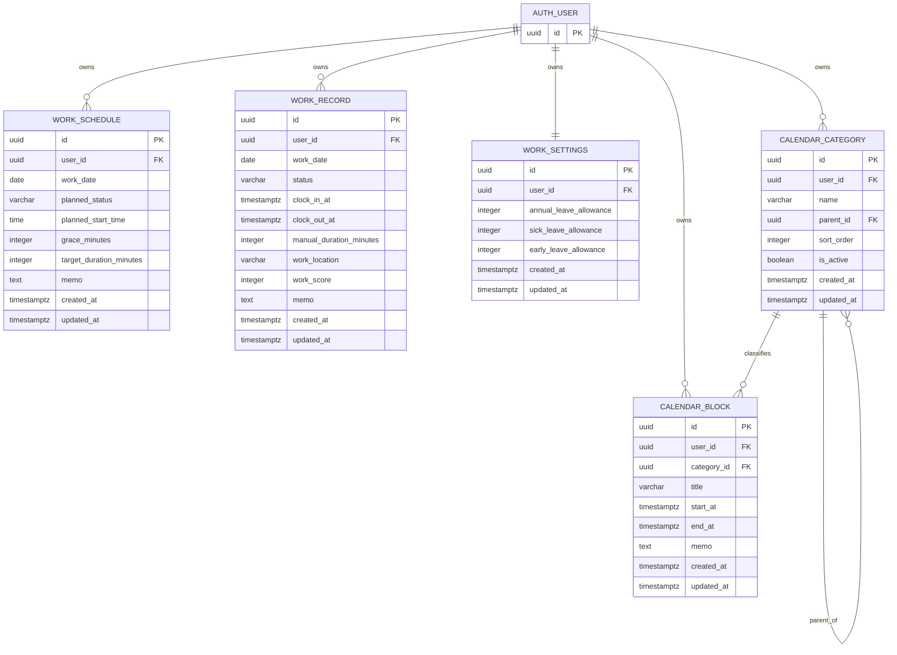

# Database Schema — Time & Work Management V1

> **Naming note (post-V1):** the category and time-block tables described in
> this V1 document as `CALENDAR_CATEGORY`/`calendar_categories` and
> `CALENDAR_BLOCK`/`calendar_blocks` were later renamed by Flyway migrations
> `V3` and `V4`. The current canonical names are `ActivityCategory` /
> `activity_categories` and `PlannedTimeBlock` / `planned_time_blocks`.
> `ActivityCategory` is the single user-owned category model shared across
> Planning, Work Log work-time entries, the future time calendar, and future
> plan-versus-actual analytics — it is not Planning-only. This document's
> table and column names below reflect the original V1 design and are not
> otherwise updated for every subsequent rename; see the migration files
> under `backend/src/main/resources/db/migration` for the authoritative
> current schema.

## 1. Overview

This document defines the initial ERD for the **Time & Work Management V1** module.

The schema is designed around five main business tables:

- `work_schedules`
- `work_records`
- `work_settings`
- `calendar_categories`
- `calendar_blocks`

Authentication is handled by **Supabase Auth**.  
Each business table stores the authenticated user's UUID in `user_id`.

---

## 2. ERD



---

## 3. Relationship Summary

### Supabase Auth User → Work Schedule

One user can have many date-specific work schedules.

```text
AUTH_USER 1 ───── N WORK_SCHEDULE
```

Constraint:

```text
UNIQUE (user_id, work_date)
```

A user can have only one planned work schedule for a specific date.

---

### Supabase Auth User → Work Record

One user can have many actual work records.

```text
AUTH_USER 1 ───── N WORK_RECORD
```

Constraint:

```text
UNIQUE (user_id, work_date)
```

A user can have only one actual work record for a specific date.

---

### Supabase Auth User → Work Settings

Each user has one global work settings record.

```text
AUTH_USER 1 ───── 1 WORK_SETTINGS
```

Constraint:

```text
UNIQUE (user_id)
```

---

### Calendar Category → Calendar Category

Calendar categories support a self-referencing parent-child relationship.

```text
근무시간
├─ 아웃라이어 준비
├─ 개인 프로젝트 개발
└─ 마케팅 투자
```

Example:

```text
근무시간
parent_id = NULL

개인 프로젝트 개발
parent_id = 근무시간.id
```

V1 allows a maximum category depth of **2 levels**.

This depth restriction should primarily be enforced by backend domain logic.

---

### Calendar Category → Calendar Block

Each calendar block may belong to one category.

```text
CALENDAR_CATEGORY 1 ───── N CALENDAR_BLOCK
```

Examples:

```text
13:00–15:00
근무시간 > 개인 프로젝트 개발

18:00–22:00
쿠팡 / 아르바이트
```

---

## 4. Important Domain Decisions

### Work Schedule and Work Record are separate

`work_schedules` represents the plan.

`work_records` represents the actual result.

They are intentionally not connected through a direct foreign key.

They are compared using:

```text
user_id + work_date
```

Example:

```text
WORK_SCHEDULE
2026-08-11
Planned Start: 09:00
Target Duration: 8h

            ↓ compare

WORK_RECORD
2026-08-11
Clock In: 09:08
Clock Out: 18:00
Actual Duration: 8h 52m
```

This keeps the lifecycle of planned and actual work independent.

---

### Calendar Block is not a child of Work Record

Calendar blocks represent the user's entire daily schedule, not only work.

Examples:

```text
Sleep
Hospital
Exercise
Meal
Coupang / Part-time Work
Work > Outlier Preparation
Work > Personal Project Development
```

Therefore `WORK_RECORD` and `CALENDAR_BLOCK` remain independent business concepts.

Work-related calendar statistics are calculated by filtering calendar blocks whose category belongs to the top-level `Work` category.

---

## 5. Work Schedule

Purpose:

> Define how the user plans to work on a specific date.

| Column | Type | Description |
|---|---|---|
| `id` | UUID | Primary key |
| `user_id` | UUID | Supabase Auth user |
| `work_date` | DATE | Work plan date |
| `planned_status` | VARCHAR | Planned status |
| `planned_start_time` | TIME | Planned start time |
| `grace_minutes` | INTEGER | Allowed lateness grace |
| `target_duration_minutes` | INTEGER | Target work duration |
| `memo` | TEXT | Optional note |
| `created_at` | TIMESTAMPTZ | Created timestamp |
| `updated_at` | TIMESTAMPTZ | Updated timestamp |

Recommended constraints:

```text
UNIQUE (user_id, work_date)
grace_minutes >= 0
target_duration_minutes >= 0
```

---

## 6. Work Record

Purpose:

> Store the user's actual work result for a specific date.

| Column | Type | Description |
|---|---|---|
| `id` | UUID | Primary key |
| `user_id` | UUID | Supabase Auth user |
| `work_date` | DATE | Work date |
| `status` | VARCHAR | Actual attendance status |
| `clock_in_at` | TIMESTAMPTZ | Actual clock-in |
| `clock_out_at` | TIMESTAMPTZ | Actual clock-out |
| `manual_duration_minutes` | INTEGER | Optional manual duration override |
| `work_location` | VARCHAR | Work location |
| `work_score` | INTEGER | Manual 0–100 score |
| `memo` | TEXT | Optional note |
| `created_at` | TIMESTAMPTZ | Created timestamp |
| `updated_at` | TIMESTAMPTZ | Updated timestamp |

Recommended constraints:

```text
UNIQUE (user_id, work_date)
work_score BETWEEN 0 AND 100
manual_duration_minutes BETWEEN 0 AND 1440
```

Effective work duration:

```text
if manual_duration_minutes exists
    use manual duration
else
    use clock_out_at - clock_in_at
```

---

## 7. Work Settings

Purpose:

> Store user-level settings that do not vary by date.

| Column | Type | Description |
|---|---|---|
| `id` | UUID | Primary key |
| `user_id` | UUID | Supabase Auth user |
| `annual_leave_allowance` | INTEGER | Annual leave allowance |
| `sick_leave_allowance` | INTEGER | Sick leave allowance |
| `early_leave_allowance` | INTEGER | Early leave allowance |
| `created_at` | TIMESTAMPTZ | Created timestamp |
| `updated_at` | TIMESTAMPTZ | Updated timestamp |

Date-specific lateness and target work-time rules belong in `work_schedules`.

---

## 8. Calendar Category

Purpose:

> Organize calendar blocks using a maximum two-level hierarchy.

| Column | Type | Description |
|---|---|---|
| `id` | UUID | Primary key |
| `user_id` | UUID | Supabase Auth user |
| `name` | VARCHAR | Category name |
| `parent_id` | UUID | Optional parent category |
| `sort_order` | INTEGER | UI ordering |
| `is_active` | BOOLEAN | Soft activation status |
| `created_at` | TIMESTAMPTZ | Created timestamp |
| `updated_at` | TIMESTAMPTZ | Updated timestamp |

Example:

```text
근무시간
├─ 아웃라이어 준비
├─ 개인 프로젝트 개발
└─ 마케팅 투자

쿠팡 / 아르바이트
├─ 숏
└─ 롱

생활
├─ 취침
├─ 식사
└─ 기록 정리
```

---

## 9. Calendar Block

Purpose:

> Store time blocks displayed on the Notion Calendar-style weekly time grid.

| Column | Type | Description |
|---|---|---|
| `id` | UUID | Primary key |
| `user_id` | UUID | Supabase Auth user |
| `category_id` | UUID | Optional calendar category |
| `title` | VARCHAR | Block title |
| `start_at` | TIMESTAMPTZ | Start timestamp |
| `end_at` | TIMESTAMPTZ | End timestamp |
| `memo` | TEXT | Optional note |
| `created_at` | TIMESTAMPTZ | Created timestamp |
| `updated_at` | TIMESTAMPTZ | Updated timestamp |

Constraint:

```text
end_at > start_at
```

Overlapping blocks are allowed in V1.

---

## 10. Planned Status vs Actual Status

### Planned Work Status

Initial candidates:

```text
WORK
DAY_OFF
ANNUAL_LEAVE
SICK_LEAVE
```

### Actual Work Status

Initial candidates:

```text
PRESENT
DAY_OFF
ANNUAL_LEAVE
EARLY_LEAVE
ABSENT
SICK_LEAVE
```

`EARLY_LEAVE` and `ABSENT` are treated as actual outcomes rather than planned states.

---

## 11. V1 Physical Tables

```text
work_schedules
work_records
work_settings
calendar_categories
calendar_blocks
```

Supabase Auth owns the authentication user table.

No separate application `users` table is required for V1.

---

## 12. Next Step

After reviewing and confirming this ERD:

1. Finalize column names and constraints.
2. Create the first Flyway migration.
3. Apply the migration to Supabase PostgreSQL.
4. Verify tables and constraints.
5. Implement the Spring domain layer.
