# Time & Work Management V1

> **Status:** V1 scope locked for first implementation  
> **Project:** Personal Work OS  
> **Source of truth:** This document defines the first development scope. Claude Code and implementation work should follow this document unless it is explicitly revised.

---

## 1. Purpose

The first module of Personal Work OS is a **Time & Work Management system** for freelancers and solo workers whose work schedule changes from day to day.

The system extends the existing Notion prototype rather than rebuilding requirements from scratch. The Notion version already validates the core workflow: daily clock-in/out, manual corrections, work status, work score, leave tracking, and analytics.

V1 expands that prototype in two important directions:

1. **Date-specific work planning** — each date can have its own planned start time, grace period, target work duration, and planned status.
2. **Notion Calendar-style time blocks** — the user can visually plan the entire day with two-level categories and later analyze how time was actually allocated.

---

## 2. Existing Notion Prototype

The current Notion template is treated as the product prototype and behavioral reference for V1.

### 2.1 Daily dashboard

The current dashboard supports one-tap clock-in / clock-out, work location, work score, memo, manual duration correction, and a daily summary.

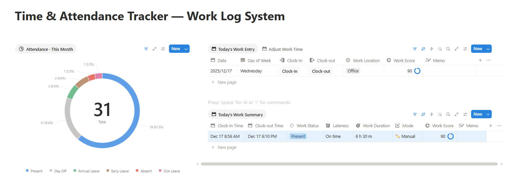

Manual corrections are already an important part of the workflow. Work duration can be overridden while preserving the original clock-in and clock-out values.

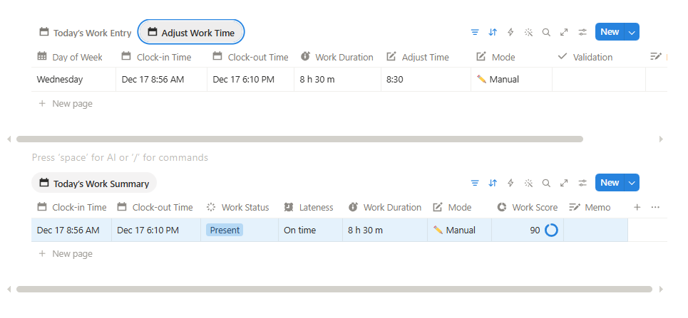

### 2.2 Work log

The existing Work Log provides weekly/monthly review of:

- Date
- Day of week
- Work status
- Lateness
- Clock-in / Clock-out
- Work duration
- Work score
- Work location
- Memo
- Auto / Manual mode

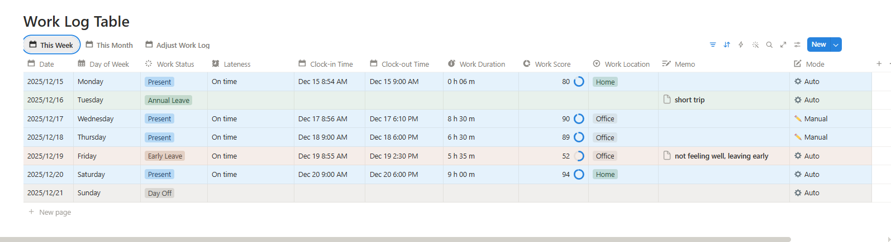

### 2.3 Attendance and work analytics

The Notion prototype already validates demand for attendance breakdowns and work-hour / work-score trends.

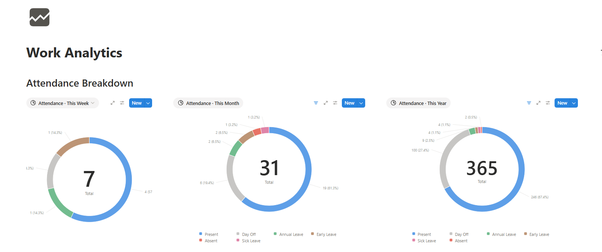

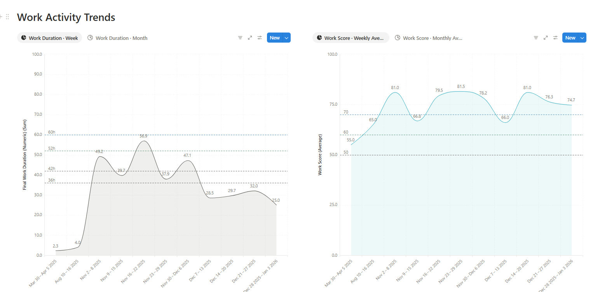

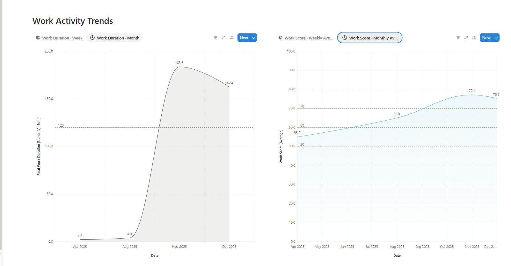

### 2.4 Work status and leave tracking

The current system tracks leave balances, usage records, absence reasons, and early-leave records.

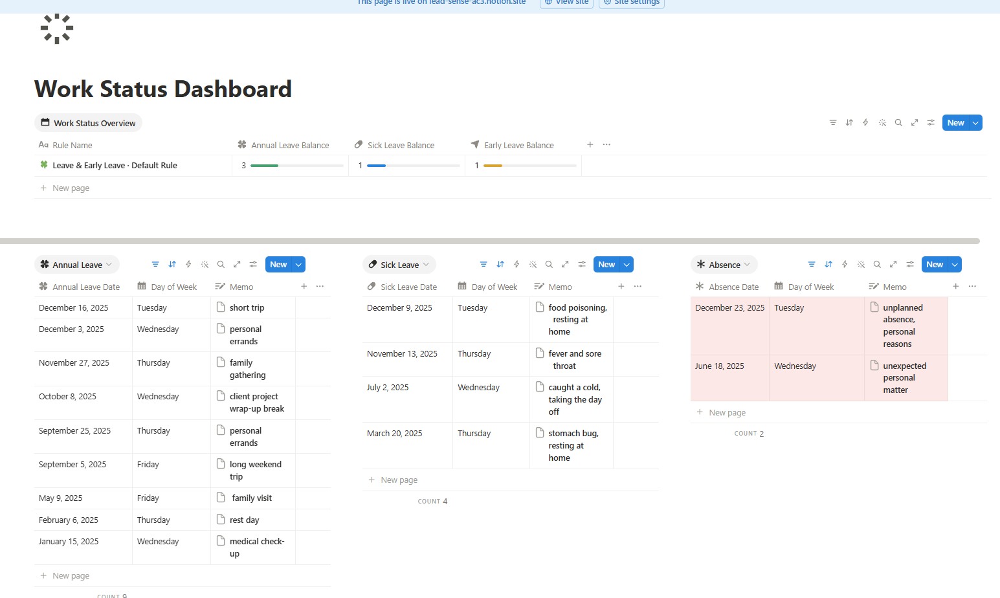

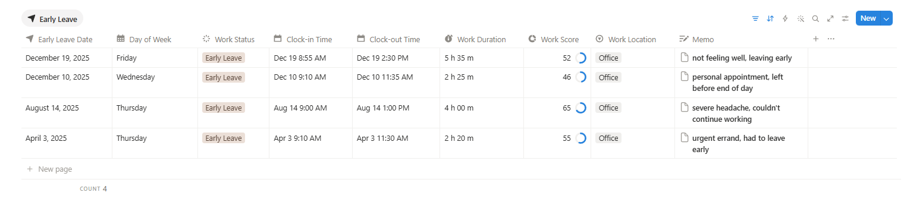

### 2.5 Settings

The Notion prototype uses global lateness and leave rules.

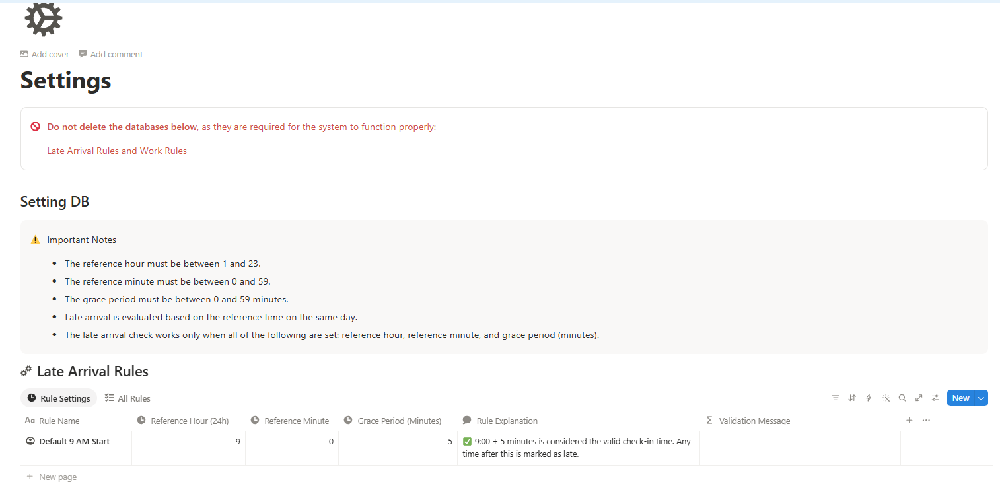

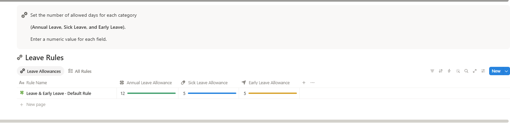

V1 keeps leave allowances as global settings, but replaces the global lateness rule with **date-specific work plans** because a freelancer's expected start time and work duration may vary every day.

---

## 3. V1 Product Structure

V1 is composed of six user-facing areas.

### 3.1 Dashboard

Daily execution screen.

Core functions:

- Clock in
- Clock out
- Edit clock-in time
- Edit clock-out time
- Set or edit actual work duration manually
- Set work status manually
- Set work location
- Enter Work Score (0–100)
- Enter memo
- View today's plan and today's actual result

### 3.2 Schedule

Date-specific work planning.

For each date the user can define:

- Planned work status
- Planned start time
- Grace period
- Target work duration
- Optional memo

No weekday-based assumption is required. Every date may have a different schedule.

### 3.3 Calendar

A Notion Calendar-style weekly time-grid for planning the whole day.

The calendar is not limited to paid/productive work. It represents the user's full schedule, including:

- Work Time > Outlier Preparation
- Work Time > Personal Project Development
- Work Time > Marketing Investment
- Coupang / part-time shifts
- Sleep
- Exercise
- Hospital / appointments
- Rest / meals
- Personal schedules
- Other user-defined blocks

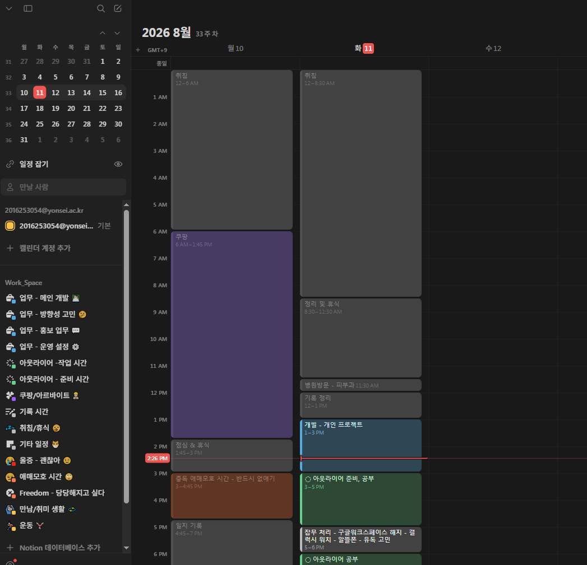

### 3.4 Work Log

Historical work records with weekly/monthly filtering and editing.

### 3.5 Analytics

Statistics based on planned work, actual work, attendance, work score, and calendar block categories.

### 3.6 Settings

Global leave allowances and calendar category management.

---

## 4. Core Domain Model

V1 separates **plan**, **actual work**, and **calendar allocation**.

```text
DailyWorkPlan
= How the user intends to work on a specific date

WorkRecord
= What actually happened that day

CalendarBlock
= How time is allocated across the entire day

BlockCategory
= Two-level category taxonomy for CalendarBlock

WorkSettings
= Global rules such as leave allowances
```

This separation is intentional. A planned work target is not the same thing as a calendar block, and neither is the same thing as the actual attendance/work record.

---

## 5. Daily Work Plan

Each date may have its own work standard.

### Required conceptual fields

```text
id
user_id
work_date
planned_status
planned_start_time
grace_minutes
target_duration_minutes
memo
created_at
updated_at
```

### Planned status

V1 should support at least:

```text
WORK
DAY_OFF
ANNUAL_LEAVE
SICK_LEAVE
```

The exact enum can be refined during implementation, but planned status must remain distinct from actual work status.

### Example

```text
2026-08-11
Planned start: 09:00
Grace: 10 min
Target work duration: 8h

2026-08-12
Planned start: 13:00
Grace: 5 min
Target work duration: 5h

2026-08-13
Day Off
```

### Lateness calculation

Lateness is the primary attendance rule calculated automatically in V1.

```text
allowed_start = planned_start_time + grace_minutes

clock_in <= allowed_start
→ ON_TIME

clock_in > allowed_start
→ LATE
```

There is no automatic Absent or Early Leave judgment in V1.

---

## 6. Work Record

A user may have at most one primary WorkRecord per date in V1.

### Conceptual fields

```text
id
user_id
work_date
status
clock_in_at
clock_out_at
manual_duration_minutes
work_location
work_score
memo
created_at
updated_at
```

### Work status

Actual status is manually controlled by the user.

```text
PRESENT
DAY_OFF
ANNUAL_LEAVE
EARLY_LEAVE
ABSENT
SICK_LEAVE
```

Rules:

- `ABSENT` is manual only in V1.
- `EARLY_LEAVE` is manual only in V1.
- `DAY_OFF` is manual only in V1.
- `Work Score` is directly entered by the user from 0–100.

### Clock-in / Clock-out

Clock-in and clock-out buttons record the current timestamp, but both timestamps must always remain editable.

Example:

```text
Original
Clock-in  09:07
Clock-out 18:04

Corrected by user
Clock-in  08:55
Clock-out 18:04
```

### Effective work duration

```text
if manual_duration_minutes exists:
    effective_duration = manual_duration_minutes
else:
    effective_duration = clock_out_at - clock_in_at
```

The original clock times are retained even when the effective duration is manually overridden.

The UI may display:

```text
AUTO   = duration derived from clock-in/out
MANUAL = duration manually overridden
```

This mode may be derived from the data and does not necessarily require a dedicated database column.

---

## 7. Calendar Block System

The Calendar is a **general-purpose day timeline**, not a work-only timeline.

### CalendarBlock conceptual fields

```text
id
user_id
start_at
end_at
category_id
title
memo
created_at
updated_at
```

A calendar block should be visually rendered on a weekly time-grid similar to Notion Calendar.

### V1 interaction target

At minimum:

- Create block
- Edit title
- Edit start/end time
- Change category
- Edit memo
- Delete block
- Week view

Drag-to-resize and drag-to-move are desirable, but may be implemented after the basic create/edit flow if needed.

---

## 8. Two-Level Block Categories

Calendar categories have a maximum depth of **2 levels** in V1.

### Example taxonomy

```text
Work Time
├─ Outlier Preparation
├─ Personal Project Development
└─ Marketing Investment

Coupang / Part-time Work
├─ Coupang Short
├─ Coupang Long
└─ Other Shift

Life
├─ Sleep
├─ Meals / Rest
└─ Personal Schedule

Exercise
├─ Weight Training
└─ Cardio
```

### BlockCategory conceptual fields

```text
id
user_id
name
parent_id
created_at
updated_at
```

Rules:

- `parent_id = null` → level 1
- `parent_id != null` → level 2
- A level-2 category cannot have children in V1

V1 should support enough category management for real use: create, rename, and archive/delete when safe.

---

## 9. Relationship Between Work Plan and Calendar

The Daily Work Plan defines the **expected work standard**.

The Calendar defines **how the day is allocated**.

Example:

```text
Daily Work Plan
Target work duration: 8h

Calendar
09:00–11:00  Work Time > Outlier Preparation
11:00–13:00  Work Time > Personal Project Development
14:00–16:00  Work Time > Marketing Investment
16:00–18:00  Work Time > Personal Project Development

Total work-category allocation = 8h
```

The system can therefore show:

```text
Target work duration       8h
Scheduled work blocks      8h
Actual effective work      7h 30m
```

This allows the user to distinguish:

- What they planned to work
- How they scheduled that time
- How much they actually worked

---

## 10. Analytics Requirements

### 10.1 Work summary

Weekly/monthly metrics should include:

- Planned work duration
- Actual effective work duration
- Plan-vs-actual difference
- Work target achievement rate
- Lateness count
- Attendance status counts
- Average Work Score

### 10.2 Category time investment

Calendar blocks must support time aggregation at both category levels.

Example:

```text
Weekly Work Time: 42h

Outlier Preparation          12h
Personal Project Development 20h
Marketing Investment         10h
```

And as proportions:

```text
Personal Project Development 47.6%
Outlier Preparation          28.6%
Marketing Investment         23.8%
```

Parent-level aggregation must also be possible.

```text
Work Time              42h
Coupang / Part-time    18h
Exercise                5h
Life                    ...
```

### 10.3 Attendance breakdown

Support weekly, monthly, and yearly breakdowns for:

```text
Present
Day Off
Annual Leave
Early Leave
Absent
Sick Leave
```

### 10.4 Trend charts

At minimum:

- Weekly actual work duration
- Monthly actual work duration
- Weekly average Work Score
- Monthly average Work Score
- Planned vs actual work duration

---

## 11. Work Settings

Global settings remain intentionally small because daily schedules are date-specific.

### V1 settings

```text
annual_leave_allowance
sick_leave_allowance
early_leave_allowance
```

Remaining allowance can be calculated from the allowance minus WorkRecord usage.

Example:

```text
Annual Leave Allowance 12
Annual Leave Used       4
Remaining               8
```

The global fixed lateness reference time from the Notion prototype is **not used** in V1. Lateness standards come from `DailyWorkPlan` for each date.

---

## 12. Primary User Flows

### Morning / start of work

```text
Open Dashboard
→ Review today's work plan
→ Review today's calendar blocks
→ Clock in
```

### During the day

```text
Follow / edit calendar blocks
→ Adjust schedule when reality changes
→ Continue working
```

### End of work

```text
Clock out
→ Review automatically calculated duration
→ Correct clock-in/out if necessary
→ Override effective duration if necessary
→ Enter Work Score
→ Set status/location/memo
```

### Planning

```text
Open Schedule / Calendar
→ Set date-specific work target
→ Add time blocks
→ Assign two-level categories
```

### Review

```text
Open Analytics
→ Compare planned vs actual hours
→ Review attendance
→ Review Work Score
→ Review time investment by category
```

---

## 13. V1 Screens

```text
Dashboard
Schedule
Calendar
Work Log
Analytics
Settings
```

### Dashboard
Focus: today's execution.

### Schedule
Focus: date-specific work standards.

### Calendar
Focus: visual time allocation across the whole day.

### Work Log
Focus: historical records and manual corrections.

### Analytics
Focus: trends, plan-vs-actual, attendance, and category investment.

### Settings
Focus: leave allowances and category management.

---

## 14. Explicitly Out of Scope for V1

The following are intentionally deferred:

- Google Calendar synchronization
- Notion Calendar synchronization
- Recurring events
- Automatic weekly schedule generation
- Copy previous week
- Automatic absence judgment
- Automatic early-leave judgment
- Project / Task management
- AI assistant features
- Team / multi-user collaboration UX
- Billing
- Complex notifications
- Full offline sync
- Microservices

These features may be added only after V1 is usable in the user's real daily workflow.

---

## 15. Technical Constraints

Existing project architecture:

```text
Frontend
- Next.js
- TypeScript
- Tailwind CSS

Backend
- Spring Boot
- Java 21
- Gradle
- Spring Data JPA
- Spring Security
- Flyway

Infrastructure
- Supabase PostgreSQL
- Supabase Auth
- GitHub
```

Architecture rules:

- Core business logic belongs in Spring Boot.
- Next.js should not directly access business tables in Supabase.
- Flyway owns schema migrations.
- Secrets must use environment variables.
- Keep the backend as a modular monolith.
- Avoid infrastructure that is not required by V1.

---

## 16. V1 Completion Criteria

V1 is considered complete when the user can use it as a real replacement for the corresponding Notion workflow for at least one full week.

Minimum acceptance criteria:

1. Create/edit a date-specific work plan.
2. Clock in and clock out.
3. Edit clock-in and clock-out timestamps.
4. Override actual work duration manually.
5. Enter status, location, score, and memo.
6. Create/edit/delete calendar blocks.
7. Assign blocks to two-level categories.
8. View the weekly calendar time-grid.
9. View weekly/monthly work logs.
10. View planned vs actual work-hour statistics.
11. View attendance statistics.
12. View Work Score trends.
13. View category-level time investment statistics.
14. Configure leave allowances.
15. Persist all data across devices through the shared backend/database.

---

## 17. Implementation Order

Recommended implementation sequence:

```text
1. Database schema
2. Flyway V1 migration
3. DailyWorkPlan backend
4. WorkRecord backend
5. BlockCategory backend
6. CalendarBlock backend
7. API tests
8. Frontend application shell
9. Dashboard
10. Schedule
11. Calendar week view
12. Work Log
13. Analytics
14. Settings
15. Real-world usage test
```

Do not add new major domains until this V1 scope is stable and usable.
